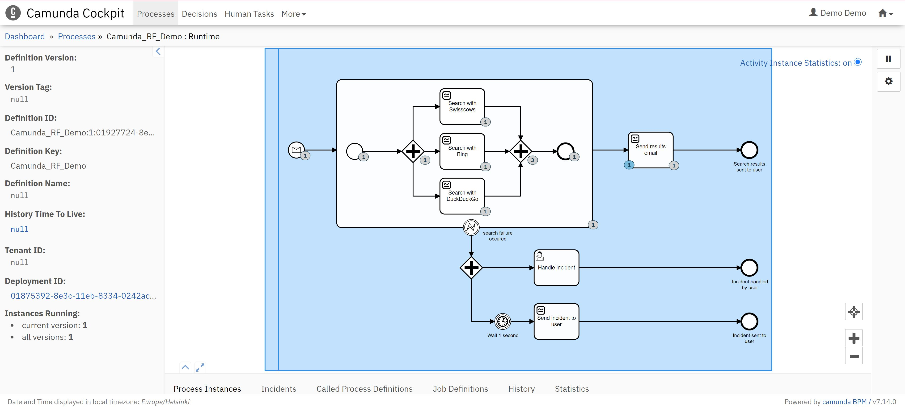
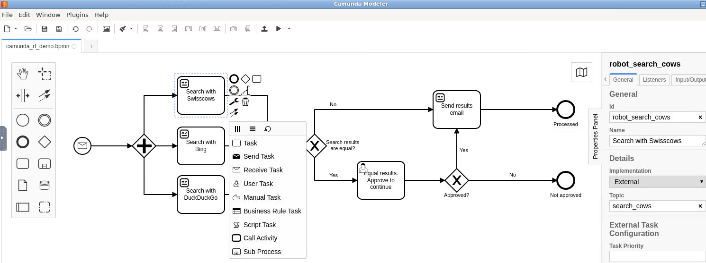
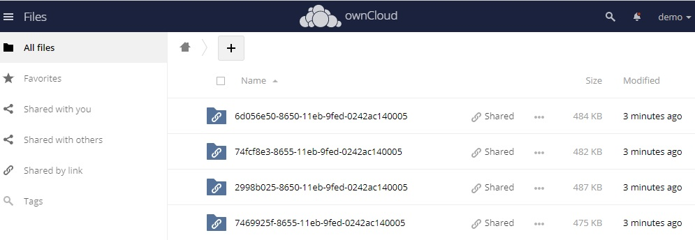

# Camunda RF Demo

- Process polls inbox and when email with subject "search" is found, sends start message to camunda engine
- Search engine robot tasks are started in parallel in different containers
- If search engine tasks got equal results, process needs manual approvement before sending results mail
- Finally results email is sent back to sender

# Spin up
- Add google mail credentials to place: https://github.com/TheProjectAurora/camunda-robotframework-demo/tree/main/credentials
- Unix socker privialedges so host docker coulbe utilized from container: ```chmod 777 /var/run/docker.sock```
- Execute: ```docker-compose up -d```
- Camunda should start answer by using user=demo pw=demo : http://localhost:8080/camunda
- If demo not work ok then empty your browser cache and reload page
# Shut down
- Execute: ```docker-compose down```
- Execute: ```docker system prune```
- List container images: ```docker image ls camunda-robotframework-demo_*```
- Remove all container images ```docker image rm IMAGENAME``` that start by: camunda-robotframework-demo_*

# novnc-camunda-modeler usage

- By default novnc-camunda-modeler is not started. Execute ```docker-compose scale novnc-with-modeler=1``` to start it.
- https://localhost should answer
- Login user=coder pw=coderpw
- Note: Copy-Paste works only by using noVNC clipboard menu left side of novnc view
- Open System tools => LXTerminal and execute: ```camunda-modeler ./model/camunda_rf_demo.bpmn```
- After model chance push it to camunda by execute:  ```sudo docker start camunda-robotframework-demo_camunda-modeler-push_1```
- Camunda is visible in novnc by starting browser Internet => Chrome/Firefox and go to by using user=demo pw=demo : http://camunda:8080/camunda

# Camunda modeler


# Robot framework results

- Report can be found in owncloud http://localhost (in novnc use: http://owncloud). Login user=demo pw=demo
- Each process instance has its own folder with merged tasks reports
- Link to each process instance report can be found from cockpit process history tab under variables "Task report"